# Transport Tickets — Android

Мобильное приложение для поиска и покупки билетов на транспорт (поезд, самолёт, автобус).  
Написано полностью на **Kotlin** с использованием **Jetpack Compose** и **Clean Architecture**.

---

## Скриншоты

<div align="center">
  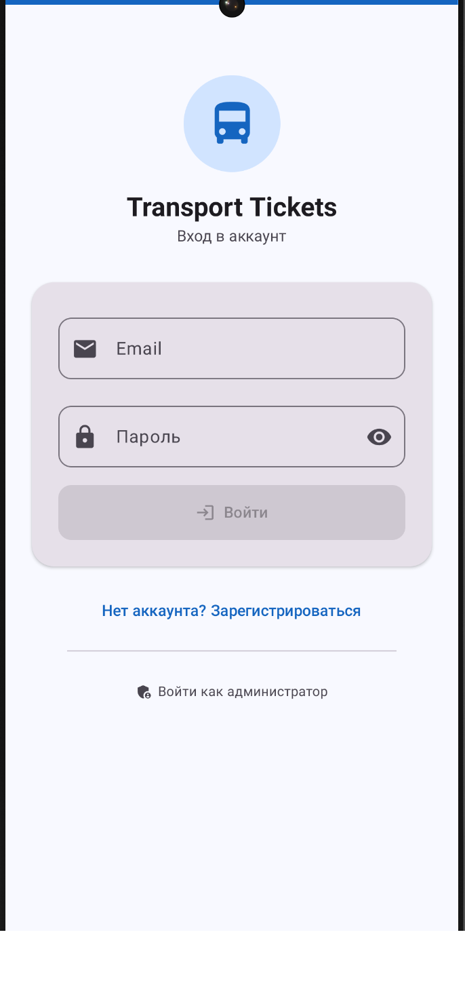
  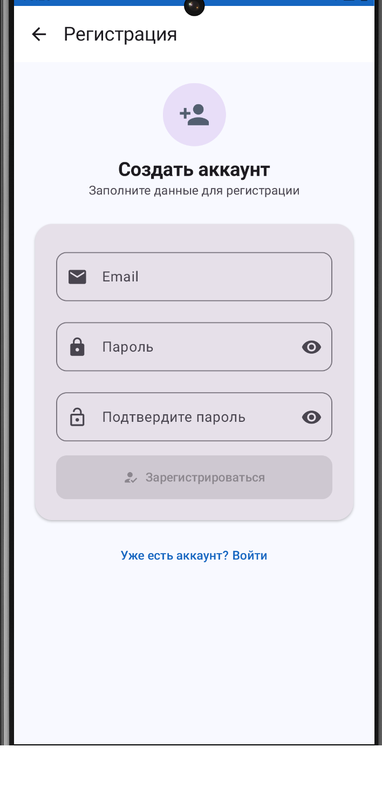
  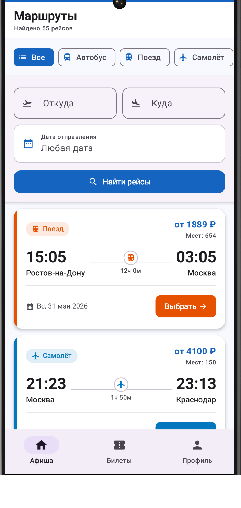
  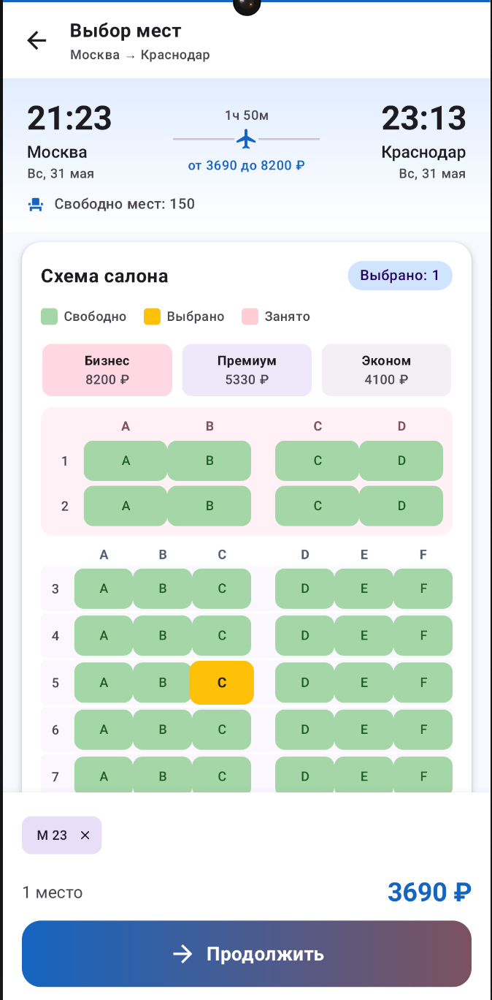
</div>

<br/>

<div align="center">
  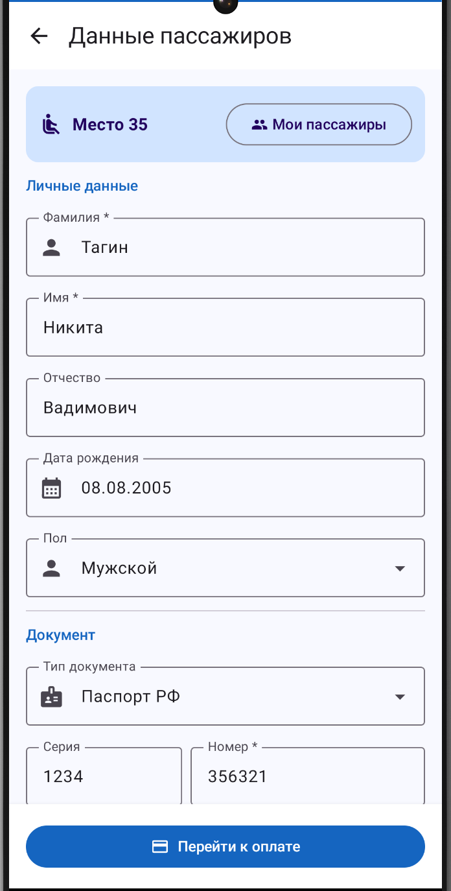
  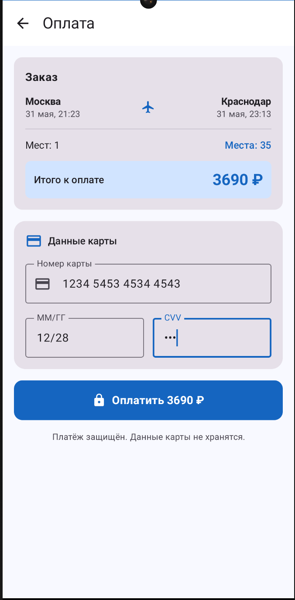
  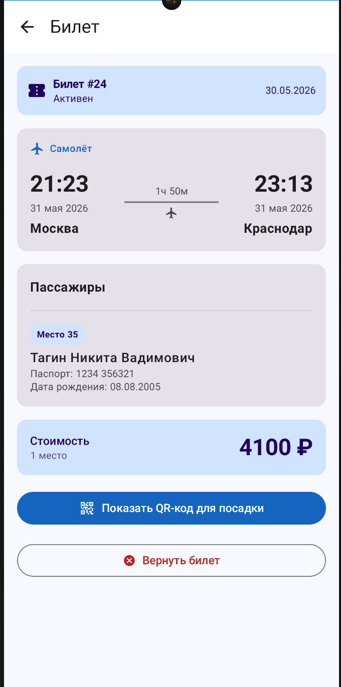
  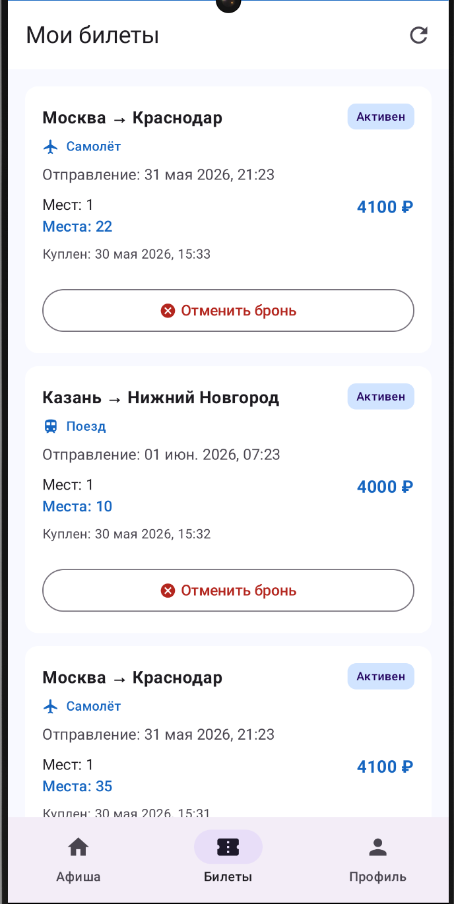
</div>

<br/>

<div align="center">
  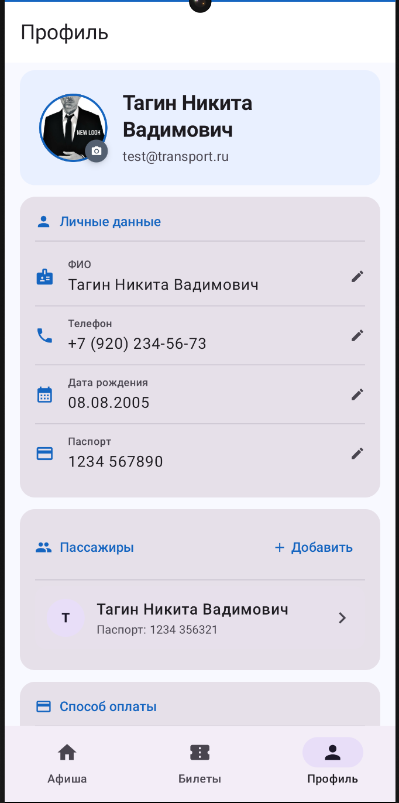
  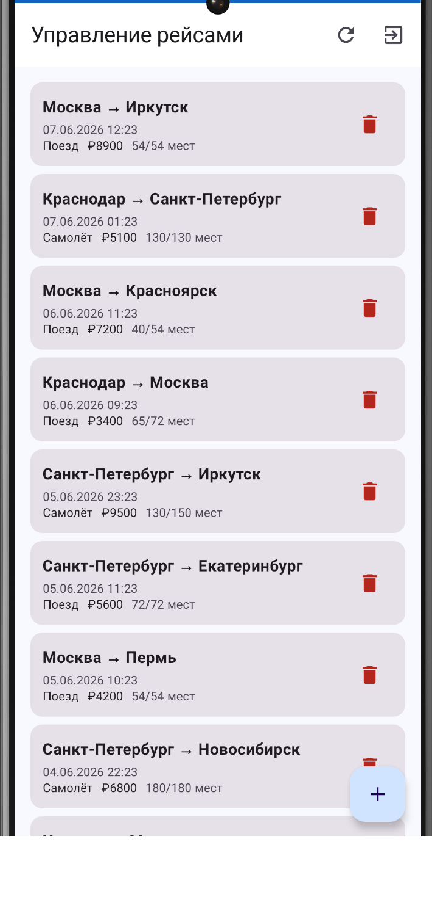
  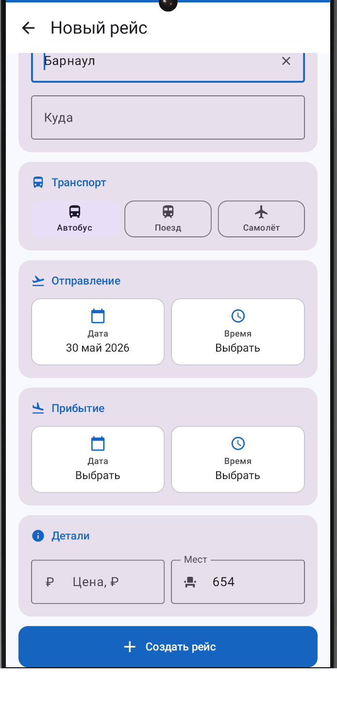
</div>

---

## Стек технологий

| Категория       | Инструмент                                     |
|-----------------|------------------------------------------------|
| Язык            | Kotlin 1.9                                     |
| UI              | Jetpack Compose, Material 3                    |
| Навигация       | Navigation Compose                             |
| DI              | Hilt                                           |
| Сеть            | Retrofit 2, OkHttp, kotlinx.serialization      |
| Локальная БД    | Room 2.6                                       |
| Настройки       | DataStore Preferences                          |
| Асинхронность   | Kotlin Coroutines + Flow                       |
| Тесты           | JUnit 4, MockK, kotlinx-coroutines-test        |

---

## Архитектура

Приложение построено по **Clean Architecture** и разделено на три слоя:

```
presentation/   — Compose UI + ViewModel (MVVM)
domain/         — Use Cases, модели данных, интерфейсы репозиториев
data/           — Реализации репозиториев, Room, Retrofit, DataStore
```

### Граф зависимостей

```
UI (Composable)
    └── ViewModel
            └── Use Case
                    └── Repository (интерфейс)
                              ├── Retrofit  (сеть)
                              ├── Room      (локальный кэш)
                              └── DataStore (настройки / история)
```

---

## Экраны

| Экран                 | Описание                                                      |
|-----------------------|---------------------------------------------------------------|
| **Вход**              | Авторизация по email и паролю, JWT сохраняется в DataStore    |
| **Регистрация**       | Создание аккаунта с подтверждением пароля                     |
| **Маршруты**          | Поиск с фильтрами по типу транспорта и дате, история запросов |
| **Выбор мест**        | Интерактивная схема вагона / салона самолёта / автобуса       |
| **Данные пассажиров** | Ввод ФИО и паспортных данных, список сохранённых пассажиров   |
| **Оплата**            | Подтверждение заказа, ввод реквизитов карты                   |
| **Мои билеты**        | Список купленных билетов, отмена бронирования                 |
| **Детали билета**     | QR-код для посадки, полная информация, возврат билета         |
| **Профиль**           | Личные данные, сохранённые пассажиры, тёмная тема             |
| **Админ-панель**      | Управление маршрутами: список, добавление, удаление           |

---

## Схемы мест

| Транспорт | Классы / Компоновка                                         |
|-----------|-------------------------------------------------------------|
| Поезд     | СВ (2 места), Купе (4 места), Плацкарт (54 места), Сидячий |
| Самолёт   | Бизнес (2+2), Премиум (3+3), Эконом (3+3)                  |
| Автобус   | 4 места в ряду                                              |

---

## Сборка и запуск

**Требования:** JDK 17+, Android SDK 34 (minSdk 26), запущенный [backend-сервер](../server/README.md).

```bash
# Debug APK
./gradlew assembleDebug
# Файл: app/build/outputs/apk/debug/app-debug.apk
```

Адрес сервера задаётся в `app/src/main/kotlin/.../di/NetworkModule.kt`:

```kotlin
private const val BASE_URL = "http://10.0.2.2:8080/"   // эмулятор Android
// private const val BASE_URL = "http://192.168.x.x:8080/" // реальное устройство
```

---

## Тесты

```bash
# Запустить 22 unit-теста (без устройства)
./gradlew testDebugUnitTest

# HTML-отчёт
open app/build/reports/tests/testDebugUnitTest/index.html
```

| Класс                     | Тестов | Что проверяется                           |
|---------------------------|--------|-------------------------------------------|
| `BuyTicketUseCaseTest`    | 5      | Валидация мест, успех, ошибки репозитория |
| `GetRoutesUseCaseTest`    | 4      | Фильтры, пустой список, refresh           |
| `GetMyTicketsUseCaseTest` | 4      | Список билетов, пустой ответ, refresh     |
| `PassengerUseCaseTest`    | 5      | CRUD пассажиров, вычисляемые поля модели  |
| `CancelTicketUseCaseTest` | 2      | Успешная отмена, проброс исключения       |
